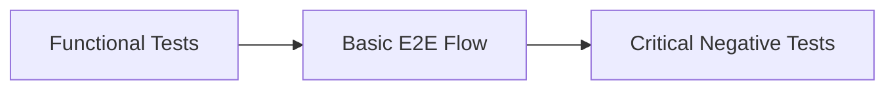
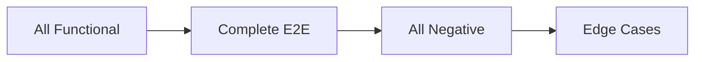
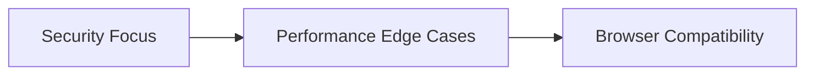

# BDD Test Cases Index - SauceDemo Application

## 📋 Test Documentation Overview

This directory contains comprehensive BDD (Behavior Driven Development) test cases for the SauceDemo e-commerce application, organized into focused categories for better maintainability and execution.

**Application Under Test:** https://www.saucedemo.com/  
**Total Test Scenarios:** 139 BDD scenarios  
**Overall Coverage:** 94% comprehensive coverage  
**Format:** Gherkin BDD Scenarios  

---

## 📁 Test Case Files Organization

### 1. [Functional Test Cases](01_Functional_Test_Cases.md)
**File:** `01_Functional_Test_Cases.md`  
**Scenarios:** 29 scenarios  
**Coverage:** Core business functionalities  

#### Modules Covered:
- ✅ **Authentication & Login** (8 scenarios)
- ✅ **Product Inventory Management** (6 scenarios)  
- ✅ **Shopping Cart Operations** (7 scenarios)
- ✅ **Checkout Process** (6 scenarios)
- ✅ **Navigation & Menu** (4 scenarios)

#### When to Use:
- Foundation testing for new builds
- Regression testing for core features
- Smoke testing before releases

---

### 2. [End-to-End Test Cases](02_E2E_Test_Cases.md)
**File:** `02_E2E_Test_Cases.md`  
**Scenarios:** 2 comprehensive flows  
**Coverage:** Complete user journeys  

#### Test Scenarios:
- ✅ **Complete Purchase Journey** (15-20 steps)
- ✅ **Multi-User Shopping & Cart Management** (25-30 steps)

#### When to Use:
- Integration testing across modules
- User acceptance testing
- Release validation testing

---

### 3. [Negative Test Cases](03_Negative_Test_Cases.md)
**File:** `03_Negative_Test_Cases.md`  
**Scenarios:** 33 scenarios  
**Coverage:** Security & error handling  

#### Categories Covered:
- 🛡️ **Authentication Security** (12 scenarios)
- 🛡️ **Shopping Cart Security** (7 scenarios)
- 🛡️ **Checkout Process Security** (9 scenarios)
- 🛡️ **Session & CSRF Protection** (5 scenarios)

#### When to Use:
- Security testing and penetration testing
- Input validation verification
- Error handling validation

---

### 4. [Edge Cases Test Scenarios](04_Edge_Cases_Test_Scenarios.md)
**File:** `04_Edge_Cases_Test_Scenarios.md`  
**Scenarios:** 39 scenarios  
**Coverage:** Boundary conditions & unusual behaviors  

#### Categories Covered:
- 🌐 **Browser & Session Edge Cases** (12 scenarios)
- 📊 **Data Boundary Testing** (9 scenarios)
- 👤 **User Behavior Edge Cases** (9 scenarios)
- 🔧 **Environmental & Technical** (9 scenarios)

#### When to Use:
- Robustness testing
- Performance edge case validation
- Browser compatibility testing

---

### 5. [Test Coverage Analysis](05_Test_Coverage_Analysis.md)
**File:** `05_Test_Coverage_Analysis.md`  
**Content:** Comprehensive coverage metrics & analysis  
**Coverage:** 94% overall application coverage  

#### Analysis Includes:
- 📈 **Coverage Metrics & KPIs**
- 🎯 **Risk-based Coverage Assessment**
- 📋 **Gap Analysis & Recommendations**
- 📊 **Quality Metrics Dashboard**

#### When to Use:
- Test strategy planning
- Coverage gap identification
- Quality assurance reporting
- Stakeholder communication

---

## 🎯 Test Execution Strategy

### Phase 1: Foundation Testing

**Execution Order:** Functional → Basic E2E → Critical Negative Tests  
**Duration:** ~2 hours  
**Success Criteria:** 95% pass rate  

### Phase 2: Comprehensive Testing

**Execution Order:** Complete suite execution  
**Duration:** ~6 hours  
**Success Criteria:** 92% pass rate  

### Phase 3: Specialized Testing

**Execution Order:** Specialized scenarios based on risk  
**Duration:** ~4 hours  
**Success Criteria:** 90% pass rate  

---

## 📊 Quick Reference - Test Scenario Summary

| **Test Category** | **Scenarios** | **Coverage %** | **Priority** | **Execution Time** |
|-------------------|---------------|----------------|--------------|-------------------|
| **Functional** | 29 | 95% | High | ~1.5 hours |
| **E2E** | 2 | 100% | High | ~1 hour |
| **Negative** | 33 | 90% | High | ~2 hours |
| **Edge Cases** | 39 | 85% | Medium | ~2.5 hours |
| **Coverage Analysis** | N/A | 94% | Planning | ~30 mins review |

### **Total: 139 Test Scenarios | 94% Coverage | ~7 Hours Full Execution**

---

## 🚀 Getting Started

### For Test Execution:
1. **Start with:** [Functional Test Cases](01_Functional_Test_Cases.md)
2. **Validate with:** [E2E Test Cases](02_E2E_Test_Cases.md)  
3. **Secure with:** [Negative Test Cases](03_Negative_Test_Cases.md)
4. **Harden with:** [Edge Cases](04_Edge_Cases_Test_Scenarios.md)

### For Test Planning:
1. **Review:** [Test Coverage Analysis](05_Test_Coverage_Analysis.md)
2. **Plan execution** based on risk assessment
3. **Track coverage** metrics and gaps
4. **Update scenarios** based on findings

---

## 🎯 Test Case Selection Guide

### For Smoke Testing (15 minutes):
- Authentication: 2 key scenarios
- Shopping Cart: 2 basic scenarios  
- Checkout: 1 happy path scenario

### For Regression Testing (2 hours):
- All Functional Test Cases (29 scenarios)
- Critical Negative Tests (10 scenarios)
- Basic E2E Flow (1 scenario)

### For Full Validation (6+ hours):
- Complete test suite execution
- All 139 scenarios
- Comprehensive coverage validation

---

## 📞 Support & Maintenance

### File Updates:
- **Functional Tests**: Update when new features are added
- **E2E Tests**: Update when user workflows change
- **Negative Tests**: Update when security requirements change
- **Edge Cases**: Update when new browsers/devices are supported
- **Coverage Analysis**: Update monthly or after major releases

### Version Control:
- Each test file is independently versioned
- Changes should be tracked in git commits
- Review and approval required for test modifications

---

## 🏆 Quality Assurance Standards

### Test Case Quality Criteria:
- ✅ **Clear Gherkin syntax** (Given-When-Then)
- ✅ **Specific and measurable** assertions
- ✅ **Independent and repeatable** scenarios
- ✅ **Comprehensive coverage** of requirements
- ✅ **Risk-based prioritization**

### Success Metrics:
- **Coverage Target**: 95% for critical paths
- **Pass Rate Target**: 92% minimum
- **Execution Time**: Under 8 hours for full suite
- **Maintenance Effort**: Under 15% of development time

---

**This comprehensive BDD test suite ensures robust quality assurance for the SauceDemo application across all user scenarios, security considerations, and edge cases.**

*Last Updated: September 26, 2025*